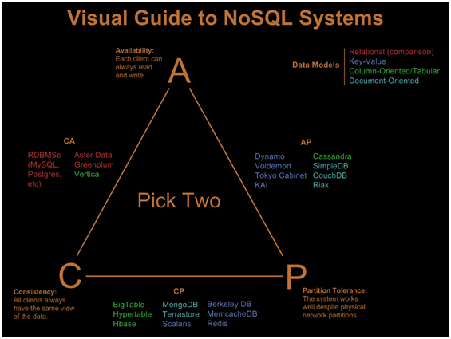

# HW1 - CAP Теорема

## Задание:
Написать к каким системам по CAP теореме относится MongoDB.

## Выполнение:
Для того, чтобы ответить на этот вопрос, нам необходимо вкратце дать определение CAP теореме и расшифрофать каждую из букв этой аббревиатуры.

**Теорема CAP** - утверждение о том, что в любой реализации распределённых вычислений возможно обеспечить не более двух из трёх следующих свойств:

**Consistency** (Согласованность) - все рабочие узлы содержат одинаковую информацию.

**Availability** (Доступность) - возможность доступа к кластеру, даже если узел в кластере выходит из строя.

**Partition Tolerance** (Терпимость к разделению сети) - независимо от сбоев в работе сети узлы продолжают работать.

Соттветственно, у нас может быть всего 3 пары из свойств выше:

**CA** - система доступна и консистентна. Нежизнеспособна в ненадежной сети.

**CP** - не будет доступна пока нет полной снхронизации между всеми узлами.

**AP** - данные на разных работающих узлах могут отличаться.

Для того, чтобы отнести MongoDB к одной из пар свойств выше, надо рассмотреть пример абстрактной распределенной MongoDB:

- MongoDB обеспечивает strong consistency, потому что это система с одним Master узлом, и все записи идут по умолчанию в него.
- Автоматическая смена мастера, в случае отделения его от остальных узлов.
- В случае разделения сети, система прекратит принимать записи до тех пор, пока не убедится, что может безопасно завершить их.

Таким образом, система может продолжать работу в случае разделения сети, но теряется CAP-availability всех узлов. Поэтому, это CP система!

[Вернуться к оглавлению](../README.md)